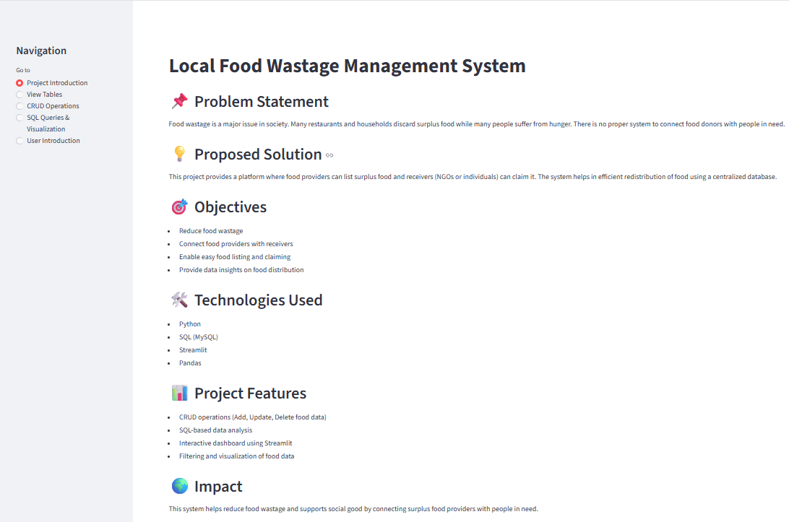
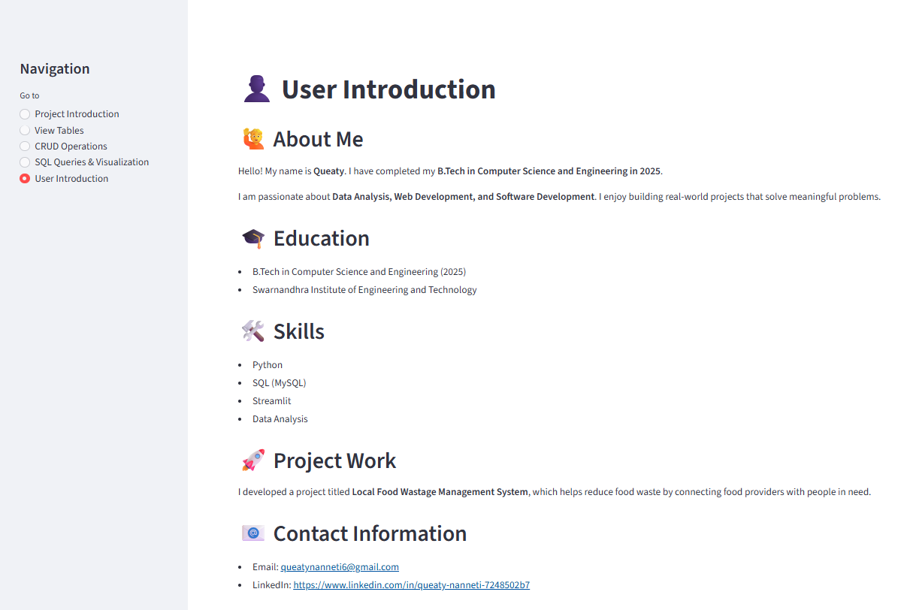
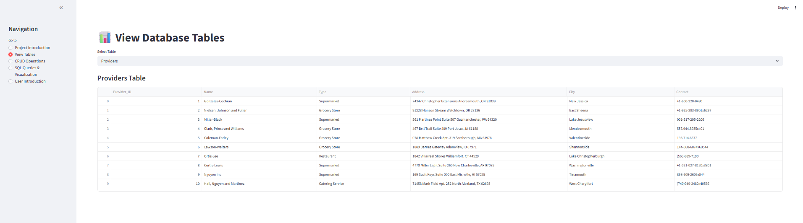
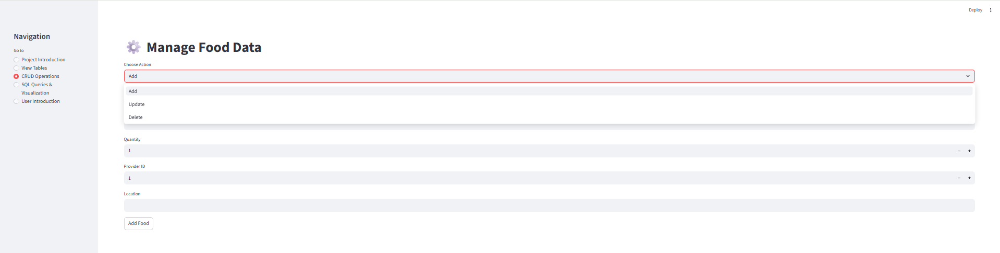
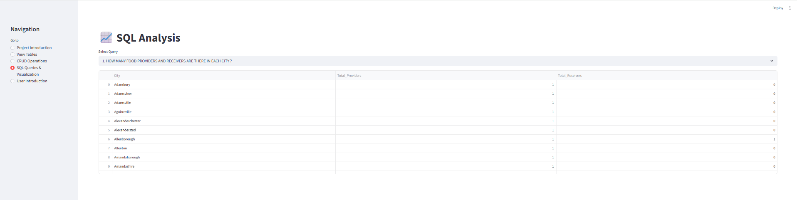

# Local Food Wastage Management Dashboard

An interactive Streamlit dashboard to manage and analyze food wastage data.

## 🚀 Features
- View food providers & receivers
- Track food listings
- Perform CRUD operations
- Data visualization using charts

## 🛠️ Tech Stack
- Python
- Streamlit
- Pandas
- SQL

## 📊 Dashboard Preview

### 🏠 Project Introduction

### 👤 User Introduction

### 📋 View Tables

### ⚙️ CRUD Operations

### 🧠 SQL Queries

